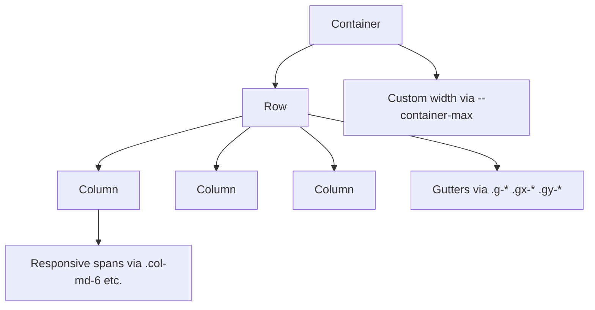
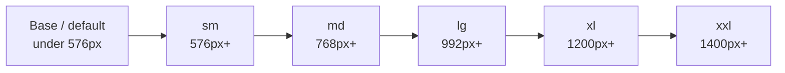
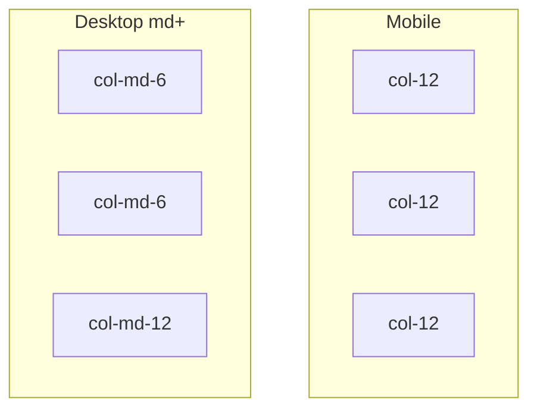
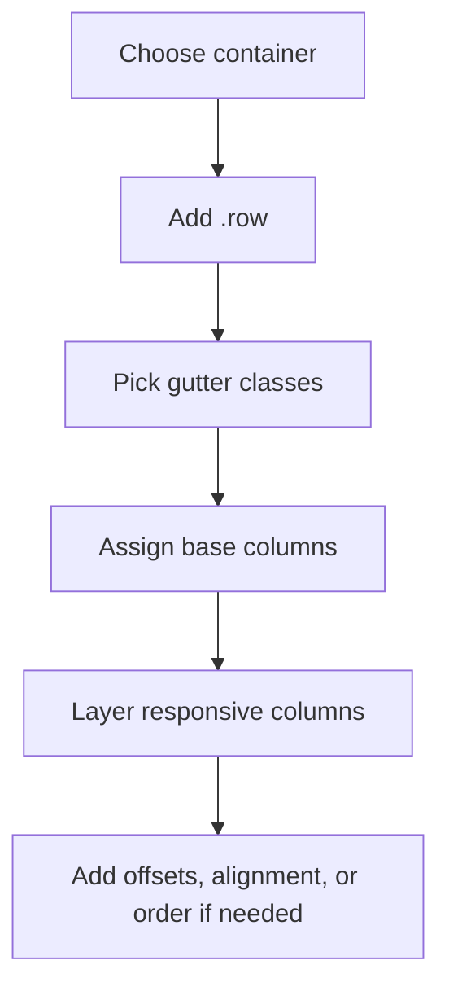

# Layouta

A lightweight, Bootstrap-inspired grid system built around a single file: [`layout.css`](./layout.css).

It gives you familiar container, row, column, offset, alignment, and order utilities without pulling in the full Bootstrap framework.

## Highlights

- Mobile-first responsive grid
- Bootstrap-like class names
- Customizable container widths with CSS variables
- Horizontal and vertical gutter utilities
- Logical offsets with RTL-friendly `margin-inline-start`
- Single-file setup with no build step

## File Structure

```text
Mini-bootstrap/
├── layout.css
└── README.md
```

## How It Works



## Mobile-First Breakpoint Flow

The grid starts with base classes for small screens, then layers larger breakpoint classes using `min-width` media queries.



## Breakpoints

| Breakpoint | Min Width | Container Max Width |
| --- | ---: | ---: |
| Base | 0px | `100%` |
| `sm` | `576px` | `540px` |
| `md` | `768px` | `720px` |
| `lg` | `992px` | `960px` |
| `xl` | `1200px` | `1140px` |
| `xxl` | `1400px` | `1320px` |

## Quick Start

Add the stylesheet to your page:

```html
<link rel="stylesheet" href="./layout.css" />
```

Use the grid:

```html
<div class="container">
	<div class="row g-4">
		<div class="col-12 col-md-6 col-xl-4">Column 1</div>
		<div class="col-12 col-md-6 col-xl-4">Column 2</div>
		<div class="col-12 col-xl-4">Column 3</div>
	</div>
</div>
```

## Layout Visualization



## Available Classes

### Containers

| Class | Purpose |
| --- | --- |
| `.container` | Responsive container that changes max width at each breakpoint |
| `.container-fluid` | Always full width |
| `.container-sm` | Locks to the `sm` container width and above |
| `.container-md` | Locks to the `md` container width and above |
| `.container-lg` | Locks to the `lg` container width and above |
| `.container-xl` | Locks to the `xl` container width and above |
| `.container-xxl` | Locks to the `xxl` container width and above |

### Rows and Gutters

| Class | Purpose |
| --- | --- |
| `.row` | Flex row with wrapping and grid gutters |
| `.g-0` to `.g-5` | Set horizontal and vertical gutter together |
| `.gx-0` to `.gx-5` | Set horizontal gutter only |
| `.gy-0` to `.gy-5` | Set vertical gutter only |

### Columns

| Class Type | Example | Purpose |
| --- | --- | --- |
| Auto fill | `.col` | Even-width flexible columns |
| Auto size | `.col-auto` | Width based on content |
| Base span | `.col-6` | Applies on all screen sizes |
| Responsive span | `.col-md-6` | Applies at the breakpoint and above |

Supported responsive prefixes:

- `.col-sm-*`
- `.col-md-*`
- `.col-lg-*`
- `.col-xl-*`
- `.col-xxl-*`

Each span supports `1` through `12`.

### Offsets

| Class Type | Example |
| --- | --- |
| Base offset | `.offset-3` |
| Responsive offset | `.offset-lg-2` |

Supported offsets:

- Base: `.offset-0` to `.offset-11`
- Responsive: `.offset-sm-*`, `.offset-md-*`, `.offset-lg-*`, `.offset-xl-*`, `.offset-xxl-*`

### Row Alignment

| Class | Purpose |
| --- | --- |
| `.justify-start` | Align items to the start |
| `.justify-end` | Align items to the end |
| `.justify-center` | Center items horizontally |
| `.justify-between` | Space between items |
| `.justify-around` | Space around items |
| `.justify-evenly` | Equal spacing |
| `.align-start` | Align items to the top |
| `.align-end` | Align items to the bottom |
| `.align-center` | Center items vertically |
| `.align-stretch` | Stretch items |
| `.align-baseline` | Align to text baseline |

### Order Utilities

| Class | Purpose |
| --- | --- |
| `.order-first` | Move item to the beginning |
| `.order-last` | Move item to the end |
| `.order-0` to `.order-5` | Manual order control |

## Examples

### Equal Columns

```html
<div class="container">
	<div class="row g-3">
		<div class="col">One</div>
		<div class="col">Two</div>
		<div class="col">Three</div>
	</div>
</div>
```

### Responsive Split Layout

```html
<div class="container">
	<div class="row g-4">
		<aside class="col-12 col-lg-4">Sidebar</aside>
		<main class="col-12 col-lg-8">Content</main>
	</div>
</div>
```

### Offset Example

```html
<div class="container">
	<div class="row">
		<div class="col-12 col-md-6 offset-md-3">Centered block</div>
	</div>
</div>
```

### Mixed Gutters

```html
<div class="container">
	<div class="row gx-4 gy-2">
		<div class="col-6 col-md-4">A</div>
		<div class="col-6 col-md-4">B</div>
		<div class="col-12 col-md-4">C</div>
	</div>
</div>
```

## Custom Container Widths

One of the main advantages of this grid is that you can override container width without creating extra container classes.

```css
.hero .container {
	--container-max: 90rem;
}

.article .container {
	--container-max: 72ch;
}
```

Example:

```html
<section class="hero">
	<div class="container">
		<div class="row">
			<div class="col-12 col-lg-8">Hero content</div>
		</div>
	</div>
</section>
```

## Core Variables

You can tune the system globally from `:root`.

```css
:root {
	--grid-columns: 12;
	--gutter-x: 1.5rem;
	--gutter-y: 0;
	--container-padding-x: 0.75rem;

	--container-sm: 540px;
	--container-md: 720px;
	--container-lg: 960px;
	--container-xl: 1140px;
	--container-xxl: 1320px;
}
```

## Notes

- Base `.col-*` classes apply on mobile too.
- Use `.col-md-*` or `.col-lg-*` if you want stacking on smaller screens first.
- Offsets use logical properties, which makes the grid friendlier for RTL layouts.
- The system is intentionally focused on layout only. It does not include typography, buttons, forms, or components.

## Recommended Usage Pattern



## License

Use and modify freely for your own projects.
